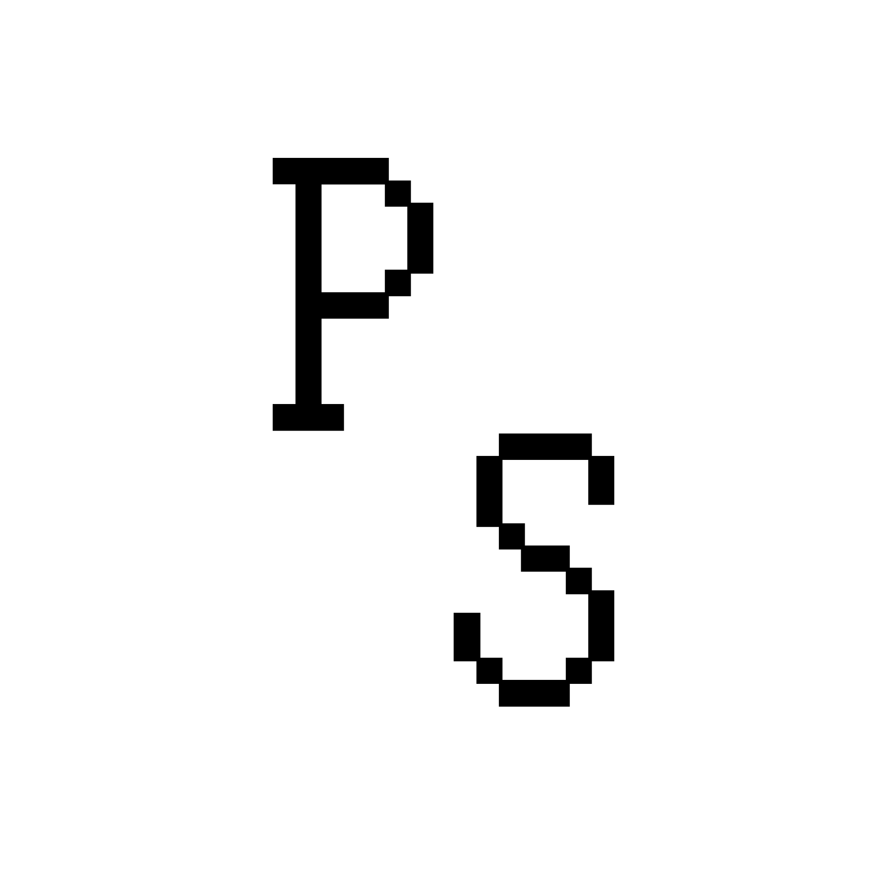

  

# Papershade

Papershade is a macOS menu-bar app that gives every display a warm, matte paper-like finish.

## See the difference

| Before | After |
| :---: | :---: |
|  |  |

## Download and install

1. **[Download Papershade.dmg](https://github.com/Chieler/KindleVue/raw/main/Papershade.dmg)**
2. Open the downloaded DMG.
3. Drag `Papershade.app` to the `Applications` folder.
4. Open **Papershade** from Applications, Launchpad, or Spotlight.

It is signed and notarized by Apple, so it should open normally. The P icon in your menu bar means it is running.

Click the menu-bar icon whenever you want to adjust the overlay's intensity, warmth, grain, or turn it off.
